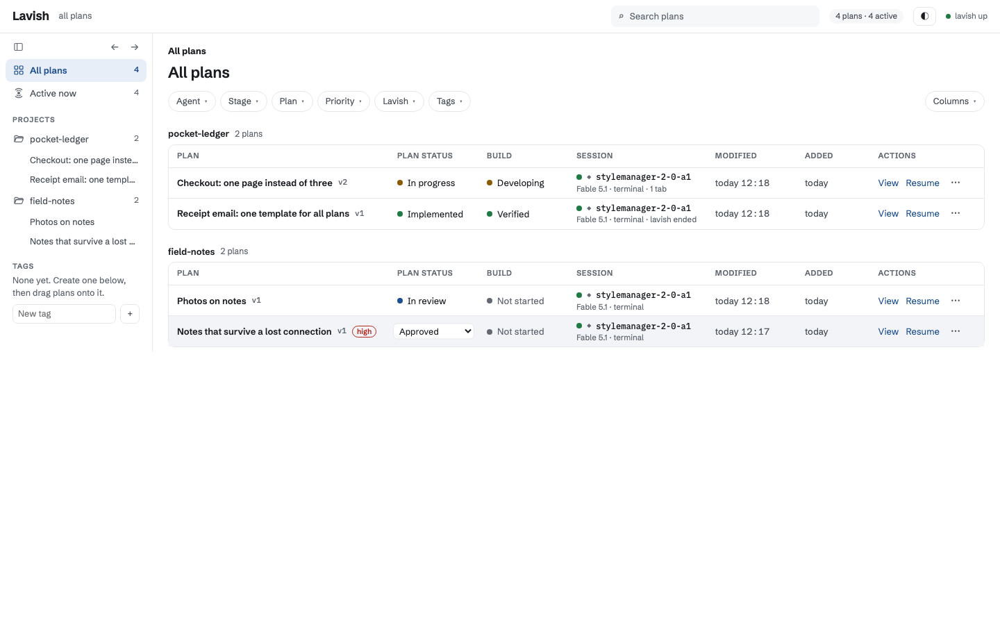
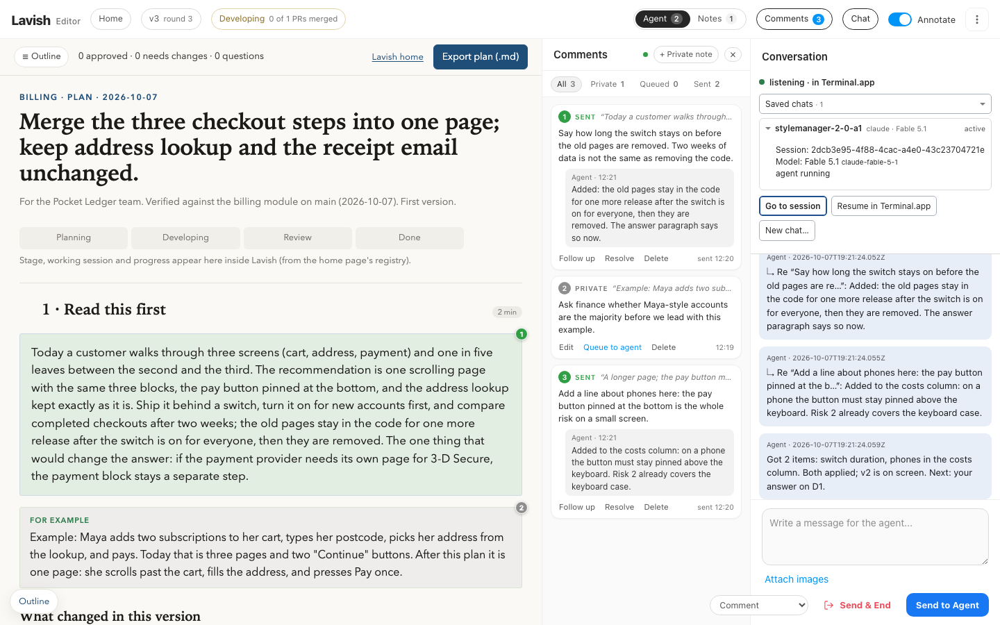
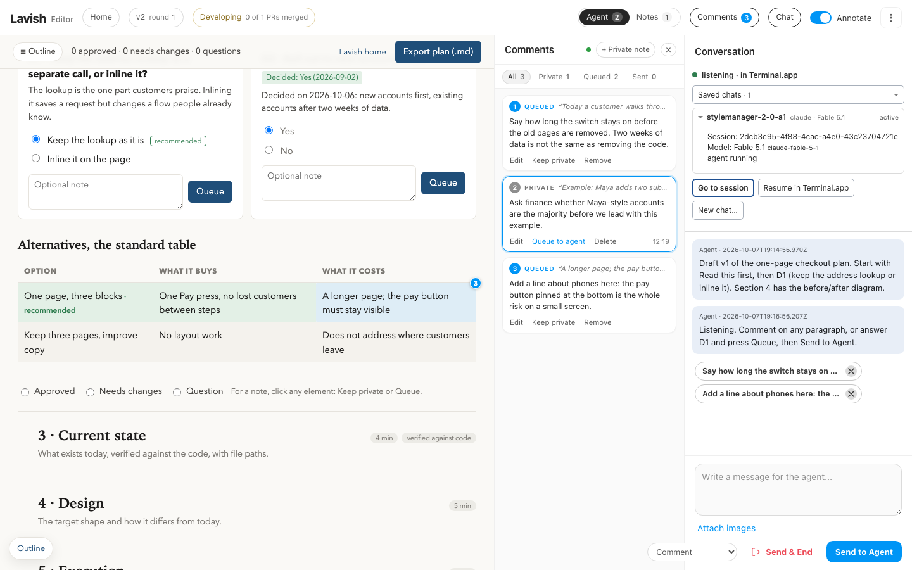
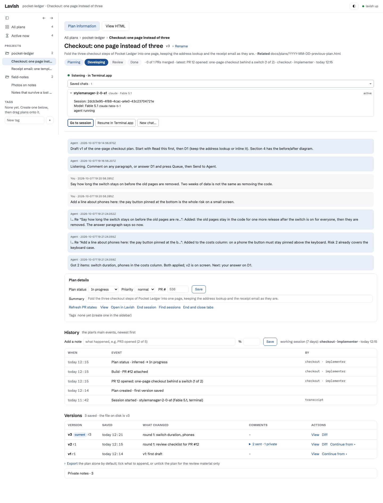
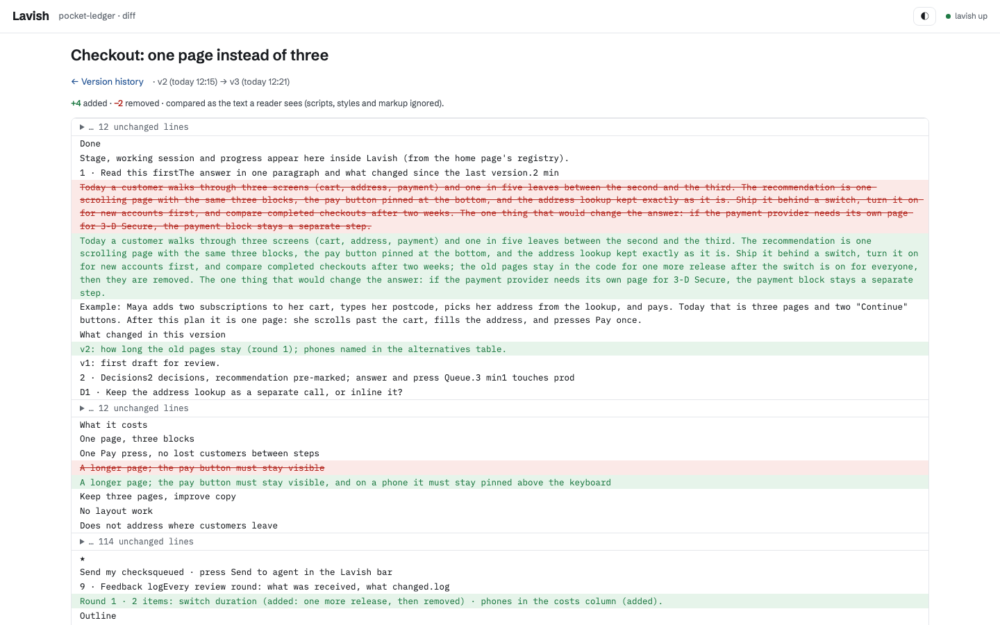
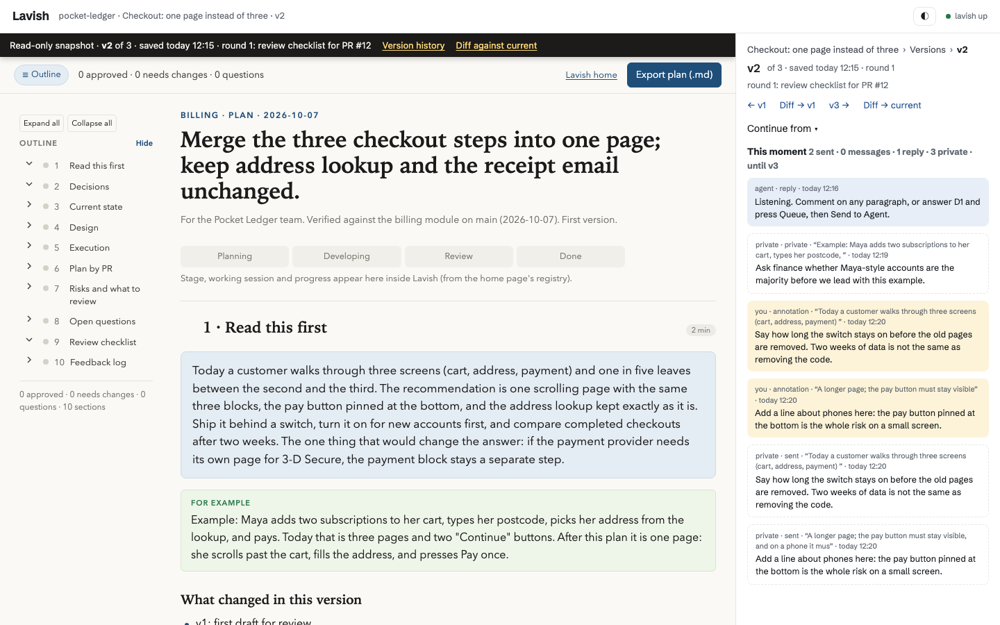
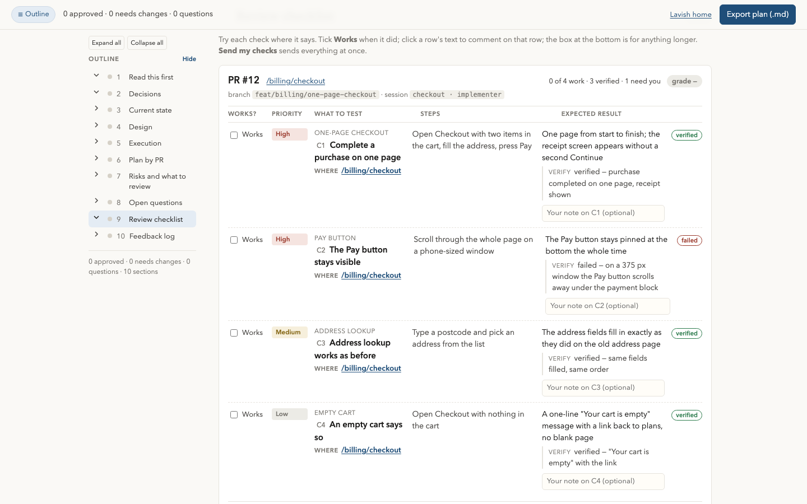

# Lavish — reviewable HTML plans for coding agents

A local toolkit around [lavish-axi](https://github.com/kunchenguid/lavish-axi) (MIT), the CLI that opens an
HTML artifact in a browser where a person can annotate it and send feedback back to the agent. This repo
pins one upstream version, patches it with the features we rely on, and adds the tooling around it:

| Piece | What it is |
| --- | --- |
| `SKILL.md` | The **lavish** skill for Claude Code / Codex: when to build an HTML plan, how to poll for feedback, the plan template rules, the design direction. Install = this folder at `~/.claude/skills/lavish`. |
| `tools/patch-lavish.mjs` | 20 anchored, idempotent edits on the installed `lavish-axi` dist: the **Comments rail** (private notes, editable queue, sent record with threaded replies, verdicts, images), paste-as-Markdown, numbered pins and re-anchoring, the home link, saved chats (`patch-plan-workspaces.mjs`). `--check` reports, `--reapply-rail` refreshes the rail without a restart. |
| `tools/lavish-poll.mjs` | `lavish-poll <plan.html>`: the poll wrapper the agent runs instead of `lavish-axi poll`. Saves a **version snapshot** when the file changed, appends every delivered item and reply to a durable **history** (`~/.lavish-axi/history/<key>.jsonl`), answers comments in threads (`--reply n`), stamps which agent session owns the plan. |
| `tools/lavish-meta.mjs` | `lavish-meta <plan.html> --status … --pr … --progress …`: the plan registry (status, PRs, progress log) the home page shows. |
| `tools/lavish-home.mjs` | The **home page** on http://127.0.0.1:4388: every plan of every project (Drive-style, tags, filters), per-plan page with the conversation, private comments, versions (view / diff / restore), sessions, history, and **Resume / New session** that reopens the agent that wrote the plan in a tmux terminal. No dependencies. |
| `tools/lavish-agent.mjs`, `lavish-chats.mjs`, `lavish-lib.mjs` | Session liveness, resume / launch argv, saved chats and delivery ownership, shared helpers. |
| `tools/plan-template.html` | The starting point for every plan (answer → decisions → evidence, sticky outline, Mermaid, export dialog, feedback log). |
| `extras/review-changes/` | The **review-changes** skill + `review-checklist` CLI: after a PR lands, a checklist of things the reviewer tries in the app is built onto the plan page (where, do, expect, screenshot), ticked in the browser, and the agent's fixes land under each row. |
| `extras/verify-changes/` | The **verify-changes** skill + `/verify` command: a manifest of falsifiable UI checks written during the work, then driven through Playwright against a dev server as a service account, with a bounded auto-fix loop. Per project. |

## What it looks like

Every screen below is the real tool running on a small demo (two fictional projects, four plans). Nothing is mocked.

### The home page: every plan of every project



One row per plan. **Plan status** is what the agent recorded with `lavish-meta`; **Build** is derived from that and the
PR states; **Session** names the agent session that last polled the plan, its model, and whether it is alive. **Resume**
reopens that session in a terminal. Filters at the top, tags in the sidebar, columns and sort remembered per browser.

### The editor: the plan, the comments rail, the conversation



Left, the plan with a numbered pin on every commented element. Middle, the **Comments rail**: each card is anchored to an
element, clicking it scrolls there; the agent's reply sits under the comment it answers. Right, the **conversation** with
the agent, the saved chats of this plan, and the Send box with the verdict picker (Comment · Approve plan · Request changes).
The top bar shows the version and round (`v3 · round 3`) and the stage (`Developing · 0 of 1 PRs merged`).

### Before Send: queued comments and a private note



Click any element, write, and press **Queue** (for the agent) or **Keep private** (a note for yourself: it is stored on this
machine through the home page and never delivered). Queued cards can be edited or removed until **Send to Agent**.
The Agent | Notes switch in the top bar counts both. Unsent comments survive a reload and a browser change.

### The plan page: conversation, history, versions



One page per plan: the stage strip, the agent block (state, session, model; Go to session, Resume, New chat), the whole
conversation including private comments in place, the status / priority / PR form, a **History** of what happened (status
changes, PRs, notes, sessions) and the **Versions** table.

### Versions: what changed between two rounds



`lavish-poll` saves a version every time the file changed since the last round. The diff compares the text a reader sees,
not the markup. A version page shows that snapshot beside the comments, replies and notes of its moment, with
**Continue from** to put it back on disk:



### The review checklist (review-changes)



After a PR lands, `review-checklist build` renders the manifest of checks into the plan itself. Each row says where to
test, what to do and what to expect; the verify run's outcome sits under the expected result; the reviewer ticks **Works**
or comments on the row and presses **Send my checks**, which reaches the agent through the same poll.

### The manifest behind it (verify-changes)

The checklist above was built from this file, written during the work and filled in by the verify run:

```
route:   /billing/checkout
branch:  feat/billing/one-page-checkout
mode:    read-only
role:    customer

CHECKS
  C1  one-page     priority: High · area: One-page checkout · test: Complete a purchase on one page · where: /billing/checkout · do: Open Checkout with two items in the cart, fill the address, press Pay · expect: One page from start to finish; the receipt screen appears without a second Continue
  C2  pay-visible  priority: High · area: Pay button · test: The Pay button stays visible · where: /billing/checkout · do: Scroll through the whole page on a phone-sized window · expect: The Pay button stays pinned at the bottom the whole time

RESULT
  C1  one-page     PASS — purchase completed on one page, receipt shown
  C2  pay-visible  FAIL — on a 375 px window the Pay button scrolls away under the payment block
  console: 0 errors
```

`/verify` drives a headless browser through those checks against a dev server, signed in as a service account, fixes what
it can in at most three rounds, and writes the RESULT block. `review-checklist build` turns the same file into the page.

## Requirements

- macOS for the full setup (the home page uses launchd, tmux, osascript and Terminal.app for Resume / New session;
  on Linux the home page runs but those buttons refuse).
- Node 22 or newer, npm.
- Claude Code at `~/.local/bin/claude` (its native install location) and/or Codex at `~/.local/bin/codex`.
  Elsewhere: set `LAVISH_CLAUDE_BIN` / `LAVISH_CODEX_BIN` (`install.sh` detects them for the launchd job).
- `tmux` for Resume / New session (`brew install tmux`). `gh` (signed in) for PR states on the home page.
- Optional: Playwright's Chromium for PDF export; `lessons` CLI if you use the review-changes lesson step.

## Install

```sh
git clone https://github.com/marcusc8/lavish.git ~/.claude/skills/lavish
sh ~/.claude/skills/lavish/tools/install.sh
```

The script installs `lavish-axi` at the pinned version (`tools/pinned-version.txt`), applies the patches,
links `lavish-poll`, `lavish-meta` and `review-checklist` into `~/.local/bin`, links the skills into
`~/.claude/skills/`, and starts the home page as a launchd job (`com.marcus.lavish-home`). Re-run it any time.
Overrides: `LAVISH_BIN`, `CLAUDE_CONFIG_DIR`, `LAVISH_HOME_PORT`, `LAVISH_NO_HOME=1`.

**Never run `npx -y lavish-axi`**: npx re-resolves "latest" and would swap in an unpatched build. Use the
global `lavish-axi` bin. To move to a newer upstream: `tools/lavish-upgrade.sh [version]` (re-applies the
patches, rolls back if an anchor no longer fits).

### Per project: verify-changes

```sh
cp -r ~/.claude/skills/lavish/extras/verify-changes <project>/.claude/skills/verify-changes
cp ~/.claude/skills/lavish/extras/verify-changes/commands/verify.md <project>/.claude/commands/verify.md
```

`mint-session.mjs` signs in a service account through Supabase's password grant using `VITE_SUPABASE_URL`,
`VITE_SUPABASE_ANON_KEY`, `DEV_AGENT_EMAIL`, `DEV_AGENT_PASSWORD` from the project's `.env.local`; for another
auth system replace that file with one that prints `{ storageKey, role, session }`. Add `.claude/verify/` to
the project's `.gitignore`.

## Daily use (what the agent does)

1. Build the plan from `tools/plan-template.html` (set `<title>`, `<meta name="description">`, `lavish:project`).
2. `lavish-axi <plan.html>` opens it in the browser; `lavish-poll <plan.html> --agent-reply "…"` waits for feedback
   (in Claude Code as a tracked background job).
3. The reviewer comments on elements, keeps private notes, queues suggestions, picks a verdict, presses Send.
4. The agent applies the feedback, answers each item with `--reply n`, labels the round with `--label`, polls again.
5. `lavish-meta <plan.html> --status in-progress --pr 123` when a PR opens from the plan; `--status merged`, then
   `--status implemented` once verified. `lavish-axi end <plan.html>` when the review is over.
6. Everything is on the home page: http://127.0.0.1:4388.

State lives under `~/.lavish-axi/` (`state.json` is upstream's store; `history/`, `versions/`, `notes/`, `queue/`,
`chats/`, `registry.json`, `home-layout.json`, `models.json`, `terminals.json` are ours). `notes/` and `queue/` are
the reviewer's private material: the agent never reads them.

## Environment variables

| Variable | Default | Used by |
| --- | --- | --- |
| `LAVISH_AXI_PORT` | 4387 | upstream server, poll, home |
| `LAVISH_AXI_STATE_DIR` | `~/.lavish-axi` | everything |
| `LAVISH_HOME_PORT` | 4388 | home page |
| `LAVISH_TMUX_BIN`, `LAVISH_CLAUDE_BIN`, `LAVISH_CODEX_BIN` | `/usr/local/bin/tmux`, `~/.local/bin/claude`, `~/.local/bin/codex` | home page (fixed paths on purpose: it never runs whatever is first on PATH) |
| `CLAUDE_CONFIG_DIR`, `CODEX_HOME` | `~/.claude`, `~/.codex` | session liveness, transcripts |
| `LAVISH_MM_URL` | `http://127.0.0.1:6161` | optional: a "Manager Marcus" workspace daemon; when nothing answers there, the home page takes its own path |

## Tests

```sh
node --test ~/.claude/skills/lavish/tools/test/*.test.mjs ~/.claude/skills/lavish/extras/review-changes/tools/test/*.test.mjs
```

A file glob, not a directory: Node 22's runner does not take a folder.

## Notes for other users

- The skill prose says "the user" for the person reviewing; the author's own setup also mentions a project
  called StyleManager and a separate tool called Manager Marcus. Neither is required.
- `tools/upstream/` holds the material for upstream PRs that were never opened (paste-as-Markdown, annotations
  kept in the chat, the comments rail), with the exact dist-level diff.
